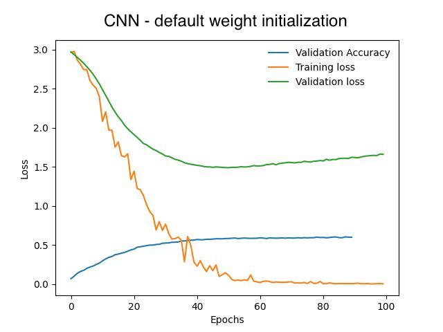
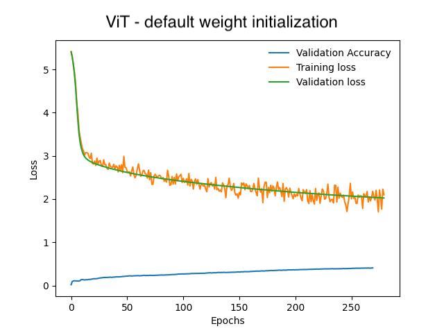
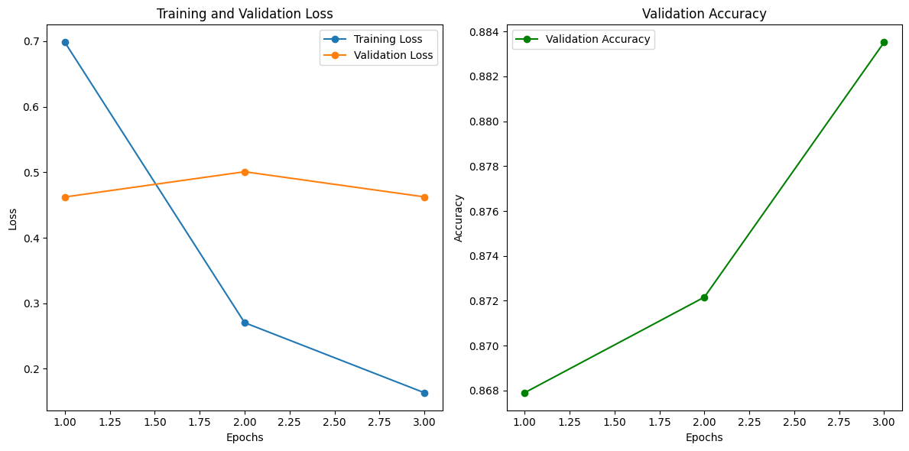

# Environmental Sound Classification using Vision Transformers and CNNs

Welcome to the **Environmental Sound Classification (ESC)** project! 🌿🎵 This repository explores state-of-the-art transformer-based architectures for classifying environmental sounds. By leveraging **Vision Transformers (ViT)** and **Audio Spectrogram Transformers (AST)**, we benchmark their performance against traditional **Convolutional Neural Networks (CNNs)**. 🚀

---

## 🎯 Objectives
- Investigate the efficacy of **ViT** and **AST** for environmental sound classification.
- Benchmark transformer-based models against traditional **CNNs**.
- Advance the field of **passive acoustic monitoring (PAM)** for applications such as urban planning, wildlife monitoring, and biodiversity studies.

---

## 📂 Repository Structure

```
├── images/              # Images
├── Bird.ipynb           # Main notebook for bird sound classification
├── cnn_resnet.ipynb     # CNN implementation notebook
├── data/                # Contains the datasets
├── data_exploration.ipynb # Notebook for data exploration and visualization
├── data_preprocessing.ipynb # Notebook for preprocessing steps
├── Environmental_Sound_Classification_based_on_Vision_Transformers.pdf # Report
├── README.md            # Project documentation
├── statistical_test/    # Contains statistical test scripts and notebooks
│   ├── data_extraction_for_statistical_test_ast.ipynb
│   ├── data_extraction_for_statistical_test_vit.ipynb
│   └── statistical_test.ipynb
├── vision_transformer.ipynb # ViT implementation notebook
```

---

## 📊 Key Results

### Model Performance
| **Model**            | **Validation Accuracy** |
|----------------------|--------------------------|
| **CNN (ResNet-50)**  | 60%                     |
| **Vision Transformer (ViT)** | 40%                     |
| **Audio Spectrogram Transformer (AST)** | **88.35%**               |

### Training and Validation Plots

#### CNN Training Loss


#### ViT Validation Accuracy


#### AST Training and Validation


---

## 🚀 Methodology

### 🛠 Data Preparation
- Dataset: Bird sound recordings (20 species).
- Preprocessing: Converted audio to **mel spectrograms** using the **Librosa** library.
- Data augmentation: Included normalization and power spectrum scaling to improve feature representation.

### 🧠 Model Architectures
1. **CNN (ResNet-50)**:
   - Pretrained weights for fast convergence.
   - Tuned for ESC tasks.
2. **Vision Transformer (ViT)**:
   - Pretrained on **ImageNet**.
   - Adapted for sound spectrogram inputs.
3. **AST**:
   - Pretrained on **AudioSet**.
   - Fine-tuned for ESC with overlapping spectrogram patches.

### 🔍 Metrics
- **Validation Accuracy**: Primary performance measure.
- **Training and Validation Loss**: To evaluate model convergence.
- **Welch's t-test**: Statistical comparison between models.

---

## 📈 Results Analysis

1. **CNN**:
   - Reached a validation accuracy of 60%.
   - Observed **overfitting**, as validation loss started increasing after 60 epochs.

2. **Vision Transformer (ViT)**:
   - Achieved 40% validation accuracy.
   - Struggled due to lack of inductive biases and dataset size.

3. **Audio Spectrogram Transformer (AST)**:
   - Outperformed both CNN and ViT with 88.35% accuracy in just **3 epochs**! 🌟
   - Leveraged overlapping patches for better feature extraction.

---

## 🌟 Highlights

- **Transformers for Sound**: Demonstrated the potential of transformer models in environmental sound classification. 
- **AST Superiority**: Audio-specific design of AST makes it ideal for spectrogram-based classification tasks.
- **Sustainability Applications**: Contributions to ecological monitoring, urban sound analysis, and biodiversity research.

---

## 🛠 How to Run the Code

### 1️⃣ Clone the Repository
```bash
git clone https://github.com/MischaRauch/environmental_sound_classification_based_on_vision_transformers.git
```

### 2️⃣ Install Dependencies
```bash
pip install -r requirements.txt
```

### 3️⃣ Run Experiments
Navigate to the `notebooks/` folder and execute the Jupyter notebooks for training and evaluation.

---

## 📚 References
- [Yuan Gong et al.](https://arxiv.org/abs/2104.01778): AST: Audio Spectrogram Transformer.
- [Dosovitskiy et al.](https://arxiv.org/abs/2010.11929): An image is worth 16x16 words: Transformers for Image Recognition at Scale.
- [K. J. Piczak](https://dl.acm.org/doi/10.1145/2733373.2806390): ESC Dataset.

---

## 🤝 Contributions
Feel free to contribute! Submit issues or pull requests to improve this project. 🙌

---

## 📬 Contact
For any inquiries, reach out at **mtrauch@kth.se** or open an issue in the repository.

---

Happy classifying! 🐦🎧✨
